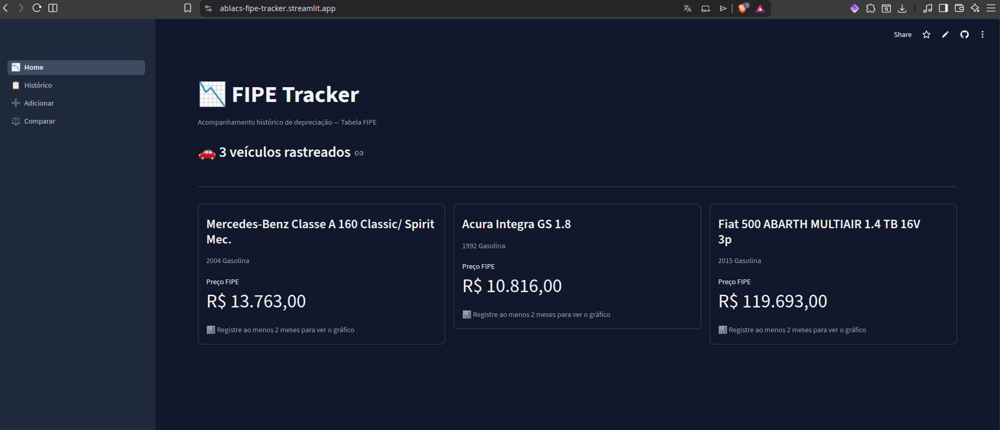

# FIPE Tracker


Dashboard interativo para acompanhar a depreciação histórica de veículos brasileiros
usando dados da Tabela FIPE.

**[Ver aplicação em produção](https://ablacs-fipe-tracker.streamlit.app)**



---

## O problema

A Tabela FIPE é atualizada todo mês, mas os sites de consulta mostram apenas o
preço atual. Sem histórico, é impossível saber se um veículo está se desvalorizando
rápido, se o preço estabilizou ou se está subindo — informação que faz diferença
real na hora de comprar ou vender.

Este projeto resolve isso coletando e armazenando os preços mensalmente,
construindo um histórico que permite visualizar a curva de depreciação real de
qualquer veículo.

---

## Funcionalidades

- Busca por marca, modelo, ano e combustível via API FIPE
- Gráfico de evolução de preço e curva de depreciação acumulada
- Comparação lado a lado entre dois veículos rastreados
- Análise de tendência com regressão linear e projeção para 3 meses
- Indicador de melhor momento para comprar baseado na tendência histórica
- Export do histórico para Excel
- Coleta automática mensal via GitHub Actions

---

## Stack

| Camada          | Tecnologia              |
| --------------- | ----------------------- |
| Dashboard       | Streamlit               |
| Gráficos        | Plotly Express          |
| Dados           | Pandas + NumPy          |
| Banco de dados  | Supabase (PostgreSQL)   |
| Containerização | Docker + Docker Compose |
| CI/CD           | GitHub Actions          |
| Deploy          | Streamlit Cloud         |
| Testes          | Pytest + unittest.mock  |

---

## Arquitetura e decisões técnicas

A API da FIPE retorna apenas o preço do mês corrente — não existe endpoint de
histórico. A estratégia do projeto é executar uma coleta mensal automatizada via
GitHub Actions que busca o preço atual de cada veículo rastreado e persiste no
Supabase.

```
API FIPE (consulta mensal)
        │
        ▼
GitHub Actions (todo dia 1 do mês)
        │
        ▼
Supabase (PostgreSQL) ←──── Streamlit Cloud (leitura/escrita em tempo real)
```

**Por que Supabase em vez de CSV no repositório:**
A abordagem inicial usava CSV commitado no próprio repo. Funciona para uso pessoal,
mas inviabiliza o deploy compartilhado — o filesystem do Streamlit Cloud é efêmero
e múltiplos usuários sobrescreveriam os dados uns dos outros. O Supabase resolve
a persistência sem adicionar infraestrutura para gerenciar.

**Próximo passo natural:** adicionar autenticação com Supabase Auth e Row Level
Security para isolar os dados por usuário. As issues do repositório documentam
esse roadmap.

---

## Estrutura do projeto

```
fipe-tracker/
├── app.py                    # roteador de navegação
├── fipe_api.py               # consultas à API FIPE com cache
├── data_processing.py        # operações no Supabase + lógica de dados
├── charts.py                 # gráficos Plotly reutilizáveis
├── pages/
│   ├── home.py               # overview dos veículos rastreados
│   ├── historico.py          # histórico, gráficos e análise de tendência
│   ├── adicionar.py          # cadastro de novo veículo
│   └── comparar.py           # comparação entre dois veículos
├── scripts/
│   └── collect_prices.py     # coleta mensal (executado pelo GitHub Actions)
├── tests/
│   └── test_data_processing.py
├── .github/
│   └── workflows/
│       └── collect_prices.yml
├── .streamlit/
│   └── config.toml           # tema customizado
├── Dockerfile
├── docker-compose.yml
├── requirements.txt
└── requirements-dev.txt
```

---

## Como rodar localmente

**Pré-requisitos:** Python 3.11+, conta no [Supabase](https://supabase.com) (gratuita)

```bash
git clone https://github.com/ablacs/fipe-tracker.git
cd fipe-tracker

python3 -m venv venv && source venv/bin/activate
pip install -r requirements.txt
```

Crie um arquivo `.env` na raiz do projeto:

```env
SUPABASE_URL=https://seu-projeto.supabase.co
SUPABASE_KEY=sua_anon_key
```

> As credenciais estão em **Supabase → Project Settings → API Keys**.

Crie as tabelas no SQL Editor do Supabase:

```sql
CREATE TABLE tracked_vehicles (
    id SERIAL PRIMARY KEY,
    brand_code TEXT, brand_name TEXT,
    model_code TEXT, model_name TEXT,
    year_code  TEXT, year_name  TEXT,
    created_at TIMESTAMP DEFAULT NOW(),
    UNIQUE (brand_code, model_code, year_code)
);

CREATE TABLE historico (
    id SERIAL PRIMARY KEY,
    data_coleta TEXT, marca TEXT, modelo TEXT, ano TEXT,
    preco       NUMERIC,
    created_at  TIMESTAMP DEFAULT NOW(),
    UNIQUE (data_coleta, marca, modelo, ano)
);
```

```bash
streamlit run app.py
```

**Com Docker:**

```bash
docker compose up --build
```

---

## Testes

```bash
pip install -r requirements-dev.txt
pytest tests/ -v
```

Os testes cobrem as funções de processamento de dados usando mocks do cliente
Supabase — sem necessidade de conexão com banco em ambiente de testes.

---

## Variáveis de ambiente

| Variável       | Descrição                      | Onde configurar                             |
| -------------- | ------------------------------ | ------------------------------------------- |
| `SUPABASE_URL` | URL do projeto Supabase        | `.env` / Streamlit Secrets / GitHub Secrets |
| `SUPABASE_KEY` | Chave anon pública do Supabase | `.env` / Streamlit Secrets / GitHub Secrets |

No Streamlit Cloud, configure em **Advanced settings → Secrets** antes do deploy.
No GitHub Actions, configure em **Settings → Secrets and variables → Actions**.

---

## Licença

MIT — veja [LICENSE](LICENSE).

---

_Desenvolvido com assistência do Claude (Anthropic) como ferramenta de desenvolvimento._
